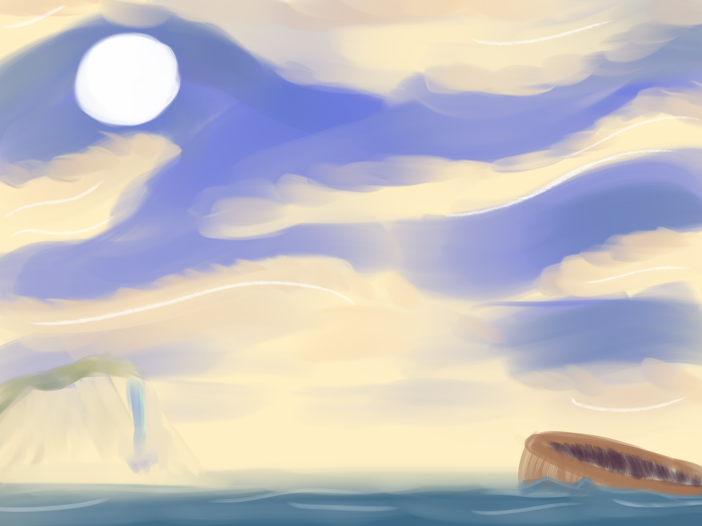

+++
author = "Logan Core"
title = "Eternal Descent"
date = 2024-05-10
last_updated = 2024-05-14
show_comments = false
categories = [
    "Project"
]
+++

{}
Replace me with banner image of some kind
{}

## **What is this game about?**

Eternal Descent is a Single player First-Person bullet hell game which tasks the player with one goal:

Survive the onslaught of enemies long enough until the path to the next level is opened.

Enemies will come out in waves which the player will need to deal with before the next wave spawns, enemies from previous waves will stay in the arena if they are not dealt with in time so the player will have to continuously stay on top of clearing enemies or risk being overwhelmed.

There will be 9 total levels, each representing a layer of hell from Dante's inferno literature.
1. [Limbo](./level_1)
2. [Lust](./level_2)
3. [Gluttony - Cerberus](./level_3)
4. [Greed](./level_4)
5. [Anger](./level_5)
6. [Heresy - The Heretic](./level_6)
7. [Violence](./level_7)
8. [Fraud](./level_8)
9. [Treachery - Final Boss](./level_9)

It should be noted that the game itself won't have a story, just planning on borrowing from Dante's Inferno for imagery and inspiration. Astute observers may notice the references but that's about it.

# *The Bell:*
Floating high above each level, the bell serve two purposes for the player:
1. Act as the level timer, letting the player know both visually and audibly how close they are to clearing a level. (At 1/3 of the way to completing a level, the special animation will play showing the bell striking itself. Calling in a new wave and signalling to the player their getting closer to the end of the level. Repeat at 2/3, and then finally play the level complete animation where the bell charges up and crashes down through the level, opening a hole for the player to follow.)(The tone/pitch of the bell should go from low bass tones to a more higher pitch as the level gets nearer to completion)

2. Can be attacked by the player which causes new waves to spawn in sooner than they normally would and also increment the score counter. Killing enemies serve the player by allowing their weapons to be upgraded, so players can have to option of facing more enemies to upgrade their weapons sooner than normal. Balancing Risk vs Reward
---

## Scoring
Instead of a traditional scoring system, Eternal Descent will have a timer that counts up which can be incremented both by staying alive and by activating more waves early by shooting the Bell that rests above each level

The player will have an incentive to call in more waves besides just points because killing enemies is the only way to upgrade their weapons. (Weapon upgrades persist between levels)

Each level will have a set time limit you must survive which isn't affected by calling in more waves early. I.E (The level is 120 seconds long and you call in more waves early by shooting the bell, speeding up the timer and getting more points, the level will still take a full 120 seconds to complete)

After the level timer timeouts, all enemies will stop spawning and the music and scenery and adjust slightly to signify to the player that the round is complete. The score timer will pause and after the player finishes up clearing the enemies that are left standing, The bell will crash through the center of the arena, leaving a hole. At the player's leisure, they can jump into the hole and follow the bell to the next level.

## **GameModes**
There will be two gamemodes for the player to choose from:

# Play:
The standard mode that starts the player from the beginning allowing the player to progress to new levels.
# Practice:
Allows the player to start from any of the floors they've reached before on previous playthroughs and select starting weapon resources.
After the player finishes a level in practice mode, the level transition hole that opens up will take the player to the same level on repeat until they switch back to Play mode.

---

Possible Level Enviroments:
- Beautiful Sky Above the clouds
- Mesa-like plateau
- Empty giant cave expanse with giant stalactites/rock columns [CERBERUS]
- Icy Abyss
- Abandoned Temple
- Eclipse Abyss (Dark Souls 3 Final boss reference) [THE HERETIC]
- Volcanic Ash
- Space, Stars, and Galaxies
- Night Stormy sky above Dark Grey Clouds [FINAL BOSS] /// Night Sky Falling through clouds (Tornado-like wit lightning) [FINAL BOSS - PART 2]

## *Player Mechanics*
Info available on [Player Controller](./player_controller) page



{}Player Controller{}

{}Player Controller{}
{}Player Controller{}

